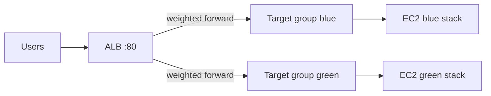

# Project Goal Overview

This README is a walkthrough for a deployment with minimal downtime and fast rollback capability. This repo and **demonstration** will take you through how a deployment goes from GitHub, utilizing GitHub Actions, AWS services being created and established, and finally monitoring within AWS. GitHub Actions will showcase application deployments using infrastructure as code and a blue-green deployment strategy practice. This includes provisioning, deploying, creating monitoring, switching traffic, and rolling back—all while using free-tier AWS services.

## Key Features

- ✅ **CI/CD Workflow:** PRs/pushes run checks + `terraform plan`; `apply/destroy` is manual via GitHub Actions `workflow_dispatch`
- ✅ **Terraform-Based Provisioning:** EC2, IAM, security groups, CloudWatch, VPC, ALB
- ✅ **Blue-Green Deployment & Rollback:** One ALB HTTP listener (port 80); traffic is weighted to the **active** stack’s target group (`active_env` = `blue` or `green`)
- ✅ **Free-Tier Friendly:** Uses AWS Free Tier–oriented choices for the demo environments
- ✅ **CloudWatch:** Dashboard monitoring and logging (when EC2 instances are created by Terraform)
- ✅ **Provider pinning:** `versions.tf` + committed `terraform.lock.hcl` for reproducible `terraform init`

## Tech Stack

| Tool               | Purpose                                  |
|--------------------|------------------------------------------|
| GitHub Actions     | CI/CD automation for checks & deployment |
| Terraform          | Infrastructure as Code (IaC)             |
| AWS EC2 (Free Tier)| Host the application stacks (blue/green) |
| IAM                | Users and permissions for the demo       |
| CloudWatch         | Monitoring and logging                 |

## Repository Layout

- **`.gitignore`** — Ignores `.terraform/`, state files, and local overrides (does **not** ignore `terraform.lock.hcl`; that file should be committed).
- **`versions.tf`** — Terraform version and `hashicorp/aws` provider constraint (`~> 6.0`).
- **`terraform.lock.hcl`** — Locks exact provider versions for CI and local runs.

## GitHub Actions

This project uses GitHub Actions for CI/CD automation.

- `pull_request` and `push` run quality checks and `terraform plan` (no automatic applies).
- `workflow_dispatch` is used when you explicitly want to `apply` or `destroy` infrastructure.

### GitHub Actions Workflow

The workflow is defined in `.github/workflows/deploy.yml`. It performs the following steps:

1. Checks out the repository
2. Sets up Terraform (version pinned in the workflow)
3. Runs `terraform fmt -check`, `terraform validate`, `tflint`, and `checkov`
4. Runs `terraform plan`

For manual runs (`workflow_dispatch`), it also:

1. Accepts inputs: `action` (`apply` \| `destroy`), `environment` (`sandbox` \| `prod`), and `active_env` (`blue` \| `green`)
2. Runs `terraform plan -out=tfplan`
3. Runs `terraform apply` (or `terraform destroy`)
4. Stops any `standby` instances after apply to reduce EC2 hours

See [Terraform Intro](https://www.terraform.io/intro/index.html) for more on Terraform.

## Terraform

Terraform defines cloud resources in versioned configuration. This project uses it for a blue-green style deployment on AWS with an Application Load Balancer.

### Terraform files

| File | Role |
|------|------|
| `versions.tf` | Terraform and AWS provider version constraints |
| `main.tf` | VPC, subnets, EC2, ALB, target groups, listener, CloudWatch, etc. |
| `variables.tf` | Input variables and validation |
| `outputs.tf` | Outputs (ALB DNS, URLs, dashboard name, etc.) |
| `iam-user.tf` | IAM users, attachments, access keys → SSM parameters |
| `terraform.tfvars` | Default variable values for this demo (committed) |
| `.github/workflows/deploy.yml` | CI/CD workflow (not Terraform, but part of the pipeline) |

### How blue/green works here

- There are **two target groups** (blue and green), each pointing at its stack’s EC2 instances.
- There is **one** `aws_lb_listener` on **port 80**. The default action uses **weighted forward**: weight `100` on the active stack’s target group and `0` on the standby stack—so all user traffic hits one URL/port and the ALB routes to the live stack.
- Instance tags (`EnvironmentStatus` = `live` \| `standby`) reflect which stack is active for operations and for the post-apply “stop standby instances” script.

Changing `active_env` and re-applying updates weights and tags so the other stack becomes live.

### Pipeline steps

1. PRs/pushes run checks and show a `terraform plan` preview.
2. To change infrastructure, run the workflow manually (`workflow_dispatch`) with inputs.
3. Terraform keeps both stacks and moves traffic by updating listener weights and tags.
4. Rollback: flip `active_env` back and re-apply.

### Key variables

- `environment`: Label for tagging/naming (`sandbox` or `prod`).
- `instances_per_stack`: EC2 count per stack (blue and green). Keep low for cost control.
- `active_env`: Which stack receives traffic (`blue` or `green`).
- `manage_alb`: Whether Terraform creates the ALB and target groups (vs. referencing existing).
- `create_ec2_instances`: Whether Terraform creates EC2 instances (otherwise it can discover and tag existing ones).

## AWS Services

This project uses EC2, security groups, an Application Load Balancer, target groups, IAM users, CloudWatch, and a VPC.

### EC2

EC2 hosts the blue and green stacks. The load balancer sends traffic to the **active** target group on **port 80**.

See [Amazon EC2](https://docs.aws.amazon.com/ec2/).

### IAM

IAM users are provisioned by Terraform for demo access patterns. Access keys are stored in AWS Systems Manager Parameter Store as `SecureString` parameters:

- Path format: `/BillyTommyTeamUp/<environment>/iam/<username>`
- Example: `/BillyTommyTeamUp/sandbox/iam/Zordon`

See [AWS IAM](https://docs.aws.amazon.com/iam/).

### CloudWatch

CloudWatch provides dashboards and logging for EC2 and ALB metrics when those resources are managed in this configuration.

See [Amazon CloudWatch](https://docs.aws.amazon.com/cloudwatch/).

### VPC

Resources run in a dedicated VPC with public subnets for this demo topology.

See [Amazon VPC](https://docs.aws.amazon.com/vpc/).